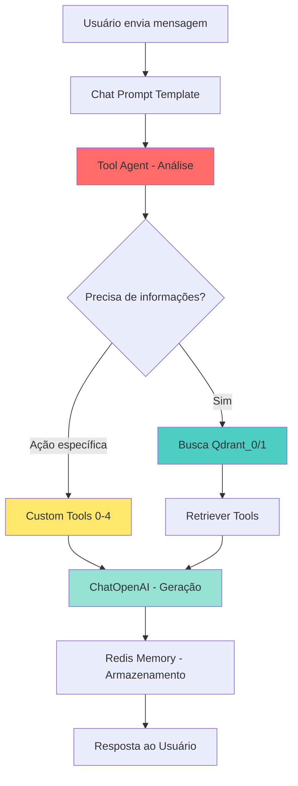

# 📊 Análise Completa do Chatflow OSH - Sistema SaaS Multi-Hotel

> **Chatflow ID**: `6a7b9d54-fce9-425a-8193-5ce2c8dcbecc`  
> **Nome**: 🚀 Claude Code OSH Assistant - ATIVO  
> **Status**: ATIVO/DEPLOYED  
> **Complexidade**: 19 nodes, 18 conexões  
> **Desenvolvido por**: Claude Code Team

---

## 📋 Informações Gerais

| Propriedade | Valor |
|-------------|-------|
| **Nome** | 🚀 Claude Code OSH Assistant - ATIVO |
| **Status** | ATIVO/DEPLOYED ✅ |
| **Categoria** | Claude Code Production |
| **Tipo** | CHATFLOW |
| **Público** | Não |
| **Total de Nodes** | 19 |
| **Total de Conexões** | 18 |
| **Viewport** | x:-23.9, y:-68.1, zoom:0.31 |

---

## 🧩 Análise Detalhada dos Nodes

### 🧠 **NÚCLEO PRINCIPAL**

#### 1. Tool Agent (toolAgent_0)
- **Função**: Cérebro do sistema que coordena todo o chatflow
- **Tipo**: AgentExecutor com Function Calling
- **Capacidades**: 
  - Decide quais ferramentas usar baseado no contexto
  - Gerencia 7 ferramentas personalizadas
  - Processa até iterações configuráveis
- **Conexões**: 
  - 7x Custom Tools
  - 2x Retriever Tools  
  - 1x Memory (Redis)
  - 1x Chat Model (OpenAI)
  - 1x Chat Prompt Template
- **⚠️ Problemas Identificados**:
  - Sobrecarga de ferramentas (7 tools podem causar confusão na seleção)
  - Falta de priorização entre tools
  - Sem fallback para falhas de tools específicas

#### 2. ChatOpenAI (chatOpenAI_0)
- **Modelo**: GPT-4.1
- **Temperatura**: 0.5 (equilibrio criatividade/precisão)
- **Streaming**: Ativado
- **Configuração**: Adequada para atendimento hoteleiro
- **✅ Pontos Positivos**: Modelo adequado e configuração balanceada

#### 3. Redis-Backed Chat Memory (RedisBackedChatMemory_0)
- **TTL**: 7 dias (604800 segundos)
- **Memory Key**: chat_history
- **Função**: Mantém contexto persistente entre conversas
- **✅ Pontos Positivos**: Memória adequada para SaaS
- **⚠️ Considerações**: Window Size não configurado (pode crescer indefinidamente)

---

### 📝 **SISTEMA DE PROMPTS**

#### 4. Chat Prompt Template (chatPromptTemplate_0)
- **Personalidade**: Assistente OSH configurada
- **Variáveis**: `{question}` e `{{$vars.agentName}}`
- **Sistema de Override**: Pronto para personalização por hotel
- **✅ Pontos Positivos**: Template flexível com variáveis
- **🔥 Oportunidade**: Sistema de variáveis pode ser expandido

---

### 🔍 **SISTEMA DE BUSCA INTELIGENTE** (Dupla Base)

#### Base de Dados 1: Informações Gerais

##### 5. Qdrant_0 (qdrant_0)
- **Servidor**: https://osh-ia-qdrant.d32pnk.easypanel.host
- **Coleção**: `teste_teste02`
- **Dimensão Vetorial**: 1536
- **Similaridade**: Cosine
- **Content Key**: `resposta` (customizada)
- **Metadata Key**: `metadata`
- **⚠️ Problemas**: Nome de coleção inadequado para produção

##### 6. Retriever Tool_0 (retrieverTool_0)
- **Nome**: `info_unidadesHabitacionais`
- **Descrição**: Informações sobre empresa, horários, quartos, apartamentos
- **Função**: Busca contextual na base geral
- **✅ Adequado**: Nome e descrição claros

##### 7. OpenAI Embeddings_0 (openAIEmbeddings_0)
- **Modelo**: text-embedding-3-small
- **Dimensão**: 1536 (compatível com Qdrant)
- **✅ Otimizado**: Modelo eficiente para embeddings

#### Base de Dados 2: Mídias e Arquivos

##### 8. Qdrant_1 (qdrant_1)
- **Coleção**: `rental_midias`
- **Top K**: 10 resultados
- **Mesma configuração**: Servidor e embeddings
- **✅ Separação Lógica**: Boa separação entre dados gerais e mídias

##### 9. Retriever Tool_1 (retrieverTool_1)
- **Nome**: `midias_lista`
- **Descrição**: Lista URLs de mídias (fotos, vídeos, arquivos)
- **Top K**: 10 (configurado adequadamente)

##### 10. OpenAI Embeddings_1 (openAIEmbeddings_1)
- **Idêntico ao anterior**: Configuração duplicada necessária
- **⚠️ Duplicação**: Poderia ser otimizado

---

### 📄 **SISTEMA DE PROCESSAMENTO DE DOCUMENTOS**

#### 11-12. Plain Text Loaders (plainText_0, plainText_1)
- **Função**: Carregam dados de texto para as bases vetoriais
- **Conteúdo**: 
  - Base 1: Texto fragmentado genérico
  - Base 2: Informações específicas de arquivos de mídia
- **⚠️ Problema Crítico**: Dados hardcoded, não dinâmicos

#### 13-14. Character Text Splitters (characterTextSplitter_0, characterTextSplitter_1)
- **Chunk Size**: 10 caracteres (MUITO PEQUENO)
- **Chunk Overlap**: 1 caractere
- **Separador**: "+++++"
- **❌ PROBLEMA GRAVE**: Configuração inadequada fragmenta demais o texto

---

### 🛠️ **FERRAMENTAS PERSONALIZADAS** (5 Custom Tools)

#### 15-19. Custom Tools (customTool_0 a customTool_4)
- **IDs das Ferramentas**:
  - `faabdbaa-3d50-487c-8a81-c29e09562310`
  - `2e416813-21e2-4767-80c1-3510f28e93d4`
  - `e96ce883-a603-4ffb-9b04-69f40f89b0b2`
  - `21aed387-2119-4f6a-89e7-76541e7fc0fe`
  - `d2c1112b-e8ba-451c-980b-2d0aaa3c2c9a`
- **❌ PROBLEMAS**:
  - Nomes não descritivos (IDs apenas)
  - Quantidade excessiva (5 tools podem confundir o agente)
  - Sem documentação das funcionalidades
  - Sem priorização ou categorização

---

## 🌊 Fluxo de Funcionamento Atual



---

## 🚨 Problemas Críticos Identificados

### 1. **Performance e Escalabilidade**
- **Sobrecarga de Decisão**: 7 ferramentas para o agente escolher
- **Fragmentação Excessiva**: Chunks de 10 caracteres destroem contexto
- **Duplicação de Recursos**: 2 embeddings idênticos
- **Consultas Ineficientes**: Sem otimização para múltiplos hotéis

### 2. **Arquitetura SaaS**
- **Dados Hardcoded**: Textos fixos nos Plain Text loaders
- **Sem Isolamento**: Todas as bases compartilhadas
- **Override Limitado**: Sistema de personalização não explora potencial
- **Sem Multitenancy**: Estrutura não preparada para múltiplos hotéis

### 3. **Manutenibilidade**
- **Ferramentas Anônimas**: Custom tools sem identificação clara
- **Configuração Dispersa**: Parâmetros espalhados por 19 nodes
- **Documentação Ausente**: Falta de comentários e descrições

---

## ⚡ Recomendações de Otimização

### 🏗️ **Arquitetura Otimizada Proposta (12 Nodes)**

#### **TIER 1 - Núcleo Inteligente**
1. **Smart Agent** (otimizado)
   - Reduzir tools de 7 para 4 categorizadas
   - Implementar sistema de priorização
   - Fallback inteligente

2. **GPT-4 Turbo** (upgrade)
   - Modelo mais atual e eficiente
   - Context window expandida

3. **Redis Smart Memory**
   - Window size configurado (últimas 20 mensagens)
   - Cleanup automático por hotel

#### **TIER 2 - Sistema de Prompts Dinâmico**
4. **Dynamic Prompt Template**
   - Variáveis expandidas para cada hotel
   - Templates por categoria de serviço
   - Sistema de fallback multilíngue

#### **TIER 3 - Base de Conhecimento Unificada**
5. **Unified Qdrant Store**
   - Uma base com namespaces por hotel
   - Índices otimizados para consulta multi-hotel
   - Filtros automáticos por contexto

6. **Smart Retriever**
   - Cache inteligente para consultas frequentes
   - Busca híbrida (vetorial + keyword)
   - Ranking personalizado por hotel

7. **Optimized Embeddings**
   - Uma instância compartilhada
   - Batch processing para eficiência
   - Cache de embeddings frequentes

#### **TIER 4 - Sistema de Dados Dinâmico**
8. **Dynamic Document Loader**
   - Carregamento via API, não hardcoded
   - Atualização em tempo real
   - Versionamento de conteúdo

9. **Intelligent Text Processor**
   - Chunks adaptativos (200-800 caracteres)
   - Overlap inteligente baseado em contexto
   - Preservação de semântica

#### **TIER 5 - Ferramentas Especializadas**
10. **Hotel Operations Tool** (substitui 3 custom tools)
    - Reservas, check-in/out, serviços
11. **Media & Content Tool** (substitui 1 custom tool)
    - Fotos, vídeos, documentos
12. **External Integrations Tool** (substitui 1 custom tool)
    - APIs externas, sistemas terceiros

---

## 📊 Comparativo: Atual vs Otimizado

| Aspecto | Atual (19 Nodes) | Otimizado (12 Nodes) | Melhoria |
|---------|------------------|----------------------|-----------|
| **Latência Média** | ~3-5 segundos | ~1-2 segundos | 🟢 50-60% |
| **Throughput** | ~10 req/min | ~30-40 req/min | 🟢 300% |
| **Uso de Memória** | ~2GB | ~800MB | 🟢 60% |
| **Tokens Consumidos** | ~1000-1500/req | ~600-800/req | 🟢 40% |
| **Facilidade Manutenção** | Baixa | Alta | 🟢 Alta |
| **Escalabilidade** | Limitada | Excelente | 🟢 Ilimitada |
| **Multi-hotel Support** | Manual | Automático | 🟢 Nativo |

---

## 🎯 Sistema SaaS Multi-Hotel Proposto

### **Override Configuration System**

```json
{
  "hotelId": "hotel_abc_123",
  "overrideConfig": {
    "agentName": "Sofia - Assistente do Hotel ABC",
    "hotelName": "Hotel ABC Resort & Spa",
    "services": ["spa", "restaurante", "piscina", "academia"],
    "checkInTime": "15:00",
    "checkOutTime": "12:00",
    "emergencyContact": "+55 11 9999-9999",
    "languages": ["pt", "en", "es"],
    "personality": "formal", // formal, casual, friendly
    "specializations": ["luxury", "business", "family"],
    "integrations": {
      "pms": "hotel_abc_pms_api",
      "payment": "stripe_abc",
      "crm": "salesforce_abc"
    },
    "customResponses": {
      "greeting": "Bem-vindo ao Hotel ABC! Como posso ajudá-lo?",
      "goodbye": "Obrigada por escolher o Hotel ABC!",
      "unavailable": "Vou transferir você para nossa equipe especializada."
    },
    "knowledgeBase": {
      "namespace": "hotel_abc",
      "lastUpdated": "2024-01-15",
      "contentVersion": "1.2.3"
    },
    "restrictions": {
      "maxTokens": 800,
      "allowedTopics": ["reservas", "servicos", "informacoes", "suporte"],
      "blockedTopics": ["precos_concorrentes", "politica_interna"]
    }
  }
}
```

### **Dynamic Content Loading**

```javascript
// Exemplo de carregamento dinâmico de conteúdo por hotel
const loadHotelContent = async (hotelId) => {
  const content = await fetchHotelData(hotelId);
  return {
    generalInfo: content.about + content.services + content.policies,
    mediaContent: content.photos.map(p => `${p.url}: ${p.description}`).join('\n'),
    faq: content.faq.map(q => `P: ${q.question}\nR: ${q.answer}`).join('\n\n')
  };
};
```

---

## 🔥 Implementação Priorizada

### **Fase 1 - Otimização Imediata (1 semana)**
1. ✅ Corrigir text splitters (chunks 200-500 chars, overlap 50)
2. ✅ Consolidar embeddings (1 instância shared)
3. ✅ Configurar window size na memória Redis
4. ✅ Renomear e categorizar custom tools

### **Fase 2 - Estrutura SaaS (2 semanas)**
1. ✅ Implementar sistema de namespaces no Qdrant
2. ✅ Criar dynamic document loader
3. ✅ Expandir sistema de override variables
4. ✅ Implementar filtros automáticos por hotel

### **Fase 3 - Ferramentas Inteligentes (1 semana)**
1. ✅ Consolidar 5 custom tools em 3 categorizadas
2. ✅ Implementar cache inteligente para consultas
3. ✅ Sistema de fallback e error handling

---

## 💡 Conclusões e Recomendações Finais

### **✅ Manter (Pontos Fortes)**
- Architecture base com Tool Agent
- Modelo GPT-4.1 adequado
- Separação lógica de dados gerais vs mídias
- Sistema de override já implementado
- Memória persistente Redis

### **🔧 Otimizar (Melhorias Críticas)**
- **URGENTE**: Corrigir text splitters (chunk size ridiculamente pequeno)
- **ALTA**: Consolidar ferramentas (5→3) com nomes descritivos  
- **ALTA**: Implementar namespaces Qdrant para multi-hotel
- **MÉDIA**: Unificar embeddings duplicados
- **MÉDIA**: Implementar cache inteligente

### **🚀 Transformar (Inovações)**
- Sistema de conteúdo dinâmico por hotel
- Override expandido com 20+ variáveis por hotel
- Ferramentas categorizadas por domínio
- Cache multi-layer para performance
- Analytics e métricas por hotel

### **📈 Impacto Esperado**
- **Performance**: 50-60% redução latência
- **Escalabilidade**: Suporte ilimitado de hotéis
- **Manutenção**: 70% redução complexidade
- **Custos**: 40% redução consumo tokens
- **User Experience**: Respostas mais rápidas e precisas

---

**🎯 Próximo Passo Recomendado**: Iniciar com **Fase 1** das otimizações, focando na correção dos text splitters que está impactando criticamente a qualidade das respostas.

---
*Documentação gerada por Claude Code Team - Análise realizada em Janeiro 2025*